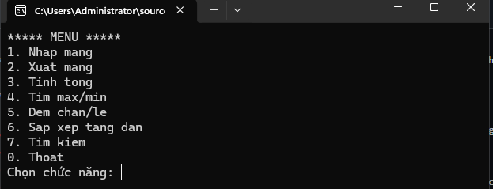
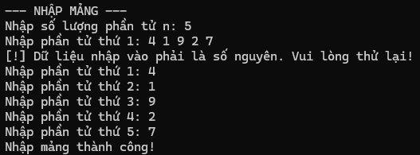
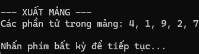
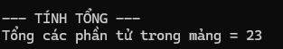
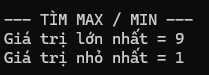
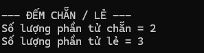
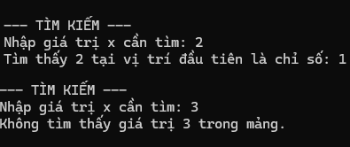

# BUỔI 2 - LAB 02: QUẢN LÝ MẢNG SỐ NGUYÊN BẰNG CONSOLE

## 1. Giới thiệu bài toán
Chương trình Console viết bằng C# quản lý một mảng số nguyên một chiều. Ứng dụng điều hướng thông qua menu dạng lặp (`do...while`), cung cấp các tính năng thao tác và tính toán trên mảng, đồng thời kiểm soát dữ liệu nhập (Input Validation) nhằm tránh lỗi dừng chương trình đột ngột.

---

## 2. Các chức năng chính
1. **Nhập mảng:** Nhập số lượng phần tử $n$ (bắt buộc $n > 0$) và các phần tử số nguyên của mảng.
2. **Xuất mảng:** Hiển thị toàn bộ các phần tử hiện có trong mảng.
3. **Tính tổng:** Tính và in tổng giá trị của tất cả phần tử trong mảng.
4. **Tìm Max / Min:** Tìm và hiển thị giá trị lớn nhất và giá trị nhỏ nhất.
5. **Đếm Chẵn / Lẻ:** Thống kê số lượng phần tử là số chẵn và số lượng phần tử là số lẻ.
6. **Sắp xếp tăng dần:** Áp dụng thuật toán sắp xếp đổi chỗ trực tiếp để sắp xếp mảng theo thứ tự tăng dần.
7. **Tìm kiếm:** Nhập một số nguyên $x$, kiểm tra sự tồn tại và in ra chỉ số (index) xuất hiện đầu tiên của $x$ trong mảng.
0. **Thoát:** Kết thúc phiên làm việc của chương trình.

---

## 3. Kiến trúc mã nguồn & Giải thích các hàm
Chương trình được thiết kế theo tư duy mô-đun hóa (modular programming), tách nhỏ các chức năng thành các hàm `static`:

| STT | Tên phương thức | Kiểu trả về | Mô tả chi tiết |
| :--- | :--- | :--- | :--- |
| 1 | `NhapSoNguyen(string message)` | `int` | Nhập dữ liệu và dùng `int.TryParse` để ép kiểu. Bắt người dùng nhập lại nếu nhập sai định dạng. |
| 2 | `NhapSoNguyenDuong(string message)` | `int` | Kế thừa từ `NhapSoNguyen`, kiểm tra điều kiện bổ sung số nhập vào phải $> 0$ (dùng cho số lượng $n$). |
| 3 | `NhapMang()` | `int[]` | Khởi tạo mảng với kích thước $n$ và nhập từng phần tử. |
| 4 | `XuatMang(int[] a)` | `void` | Duyệt mảng và in các phần tử ra màn hình dạng danh sách phân cách bởi dấu phẩy. |
| 5 | `TinhTong(int[] a)` | `int` | Duyệt qua mảng bằng vòng lặp `foreach` và cộng dồn tổng các phần tử. |
| 6 | `TimMax(int[] a)` / `TimMin(int[] a)` | `int` | Gán phần tử đầu tiên làm mốc, duyệt mảng từ vị trí 1 để so sánh tìm cực trị. |
| 7 | `DemChan(int[] a)` / `DemLe(int[] a)` | `int` | Kiểm tra điều kiện chia dư `item % 2 == 0` (hoặc `!= 0`) để đếm số lượng. |
| 8 | `SapXepTangDan(int[] a)` | `void` | Hoán đổi 2 phần tử nếu `a[i] > a[j]` bằng biến tạm trung gian (`temp`). |
| 9 | `TimKiem(int[] a, int x)` | `int` | Tìm kiếm tuyến tính (Linear Search). Trả về chỉ số $i$ đầu tiên nếu thấy, hoặc `-1` nếu không có $x$. |
| 10 | `HienThiMenu()` | `void` | In giao diện menu lựa chọn ra màn hình. |

---

## 4. Xử lý ngoại lệ và Ràng buộc (Validation)
- **Kiểm tra trạng thái mảng:** Nếu người dùng chọn các chức năng từ 2 đến 7 khi chưa thực hiện chức năng 1 (mảng đang là `null`), hệ thống sẽ cảnh báo yêu cầu khởi tạo mảng trước.
- **Ràng buộc đầu vào:** Mọi thao tác nhập số đều được bảo vệ bởi `int.TryParse`, tránh ứng dụng bị crash khi nhập chuỗi ký tự hoặc ký tự đặc biệt.
- **Xử lý lựa chọn sai:** Nhập lựa chọn ngoài phạm vi từ 0 đến 7 sẽ hiển thị thông báo lỗi và yêu cầu chọn lại.

---

## 5. Hình ảnh minh chứng kết quả chạy chương trình

### 5.1 Giao diện Menu chính

### 5.2 Chức năng 1: Nhập mảng

### 5.3 Chức năng 2: Xuất mảng

### 5.4 Chức năng 3: Tính tổng

### 5.5 Chức năng 4: Tìm Max / Min

### 5.6 Chức năng 5: Đếm chẵn lẻ

### 5.7 Chức năng 6: Sắp xếp tăng dần

### 5.8 Chức năng 7: Tìm kiếm phần tử

